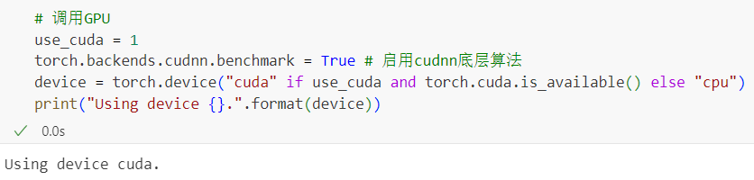
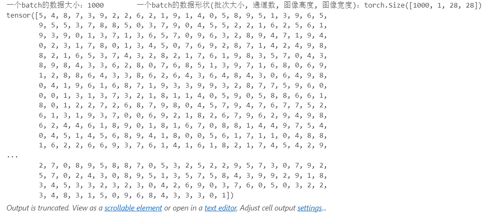
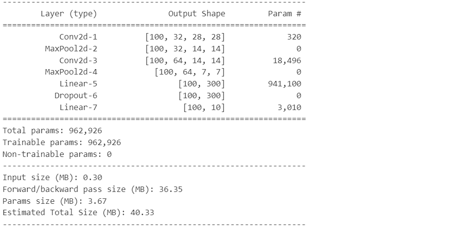
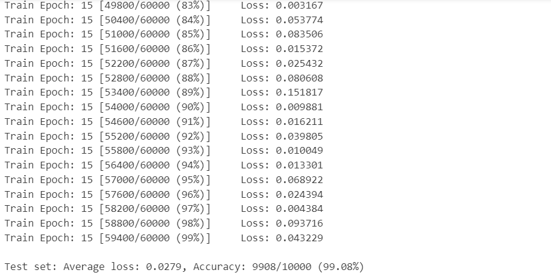
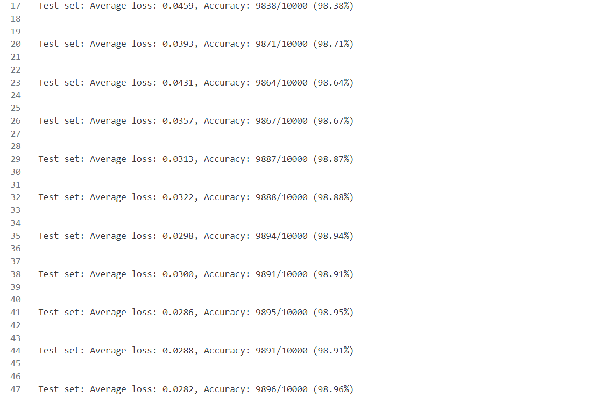
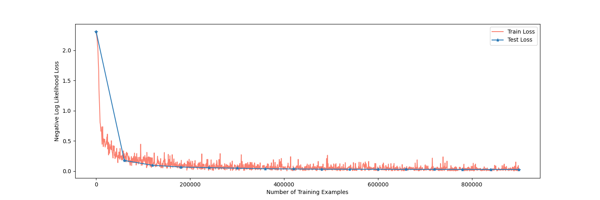

# Final Project of Fundamentals of Intelligent Science - CNN - MNIST

# 《智能科学基础》课程大作业

实验任务：手写数字识别，使用CNN模型，数据集为MNIST。

实验环境：

| 编程语言 | Python 3.8                |
| -------- | ------------------------- |
| 编译器   | Visual Studio Code 1.85.0 |
| 框架     | PyTorch 2.1.1             |
| conda    | Anaconda(conda 23.9.0)    |
| cuda     | 12.0                      |

文件组织架构：

```
FIS_project
│   README.md
│   requirements.txt
│   demo.ipynb
│   demo.py
│   main.py
│   config.py
│   test.py
│   train.py
│   model.pth
│   optimizer.pth
│
├───data
│       dataset.py
│       __init__.py
│
├───models
│       LeNet_altered.py
│       __init__.py
│
├───utils
│       img_operations.py
│       visualize.py
│       __init__.py
│
└───img
```

## 实现步骤

**1. 数据准备**

- 引入必要的库和模块：torch、torchvision、matplotlib等。
- 设置随机种子，确保实验的可重现性。
- 下载并加载MNIST数据集，并进行预处理：包括转换为Tensor格式、数据归一化等。

**2. 构建模型**

- 定义一个CNN模型，包括卷积层、池化层、Dropout层和全连接层。
- 将模型移动到GPU上（如果可用）。

**3. 模型训练**

- 设置超参数：批量大小、学习率、训练轮数等。
- 定义优化器：在这里使用SGD优化器。
- 进行训练循环：
  - 对于每个训练轮次，遍历训练数据集。
  - 将数据加载到设备上，执行前向传播、损失计算、反向传播和参数更新。
  - 记录训练过程中的损失值和批次号。

**4. 模型评估**

- 在训练过程中和训练结束后，对模型进行评估。
- 使用测试集数据对模型进行测试，计算测试集上的准确率和损失值。

**5. 结果分析**

- 可视化训练和测试过程中的损失值变化。
- 分析模型在测试集上的准确率和损失值。
- 根据结果分析模型性能，对模型或参数进行调整以优化模型。

## 网络模型

```python
        Layer (type)               Output Shape
===============================================
            Conv2d-1          [100, 32, 28, 28]
         MaxPool2d-2          [100, 32, 14, 14]
            Conv2d-3          [100, 64, 14, 14]
         MaxPool2d-4            [100, 64, 7, 7]
            Linear-5                 [100, 300]
           Dropout-6                 [100, 300]
            Linear-7                  [100, 10]
===============================================
```


## 结果展示

调用GPU进行训练：



查看数据集中部分数据的图像与标签等信息：




定义并初始化网络：



进行15轮训练和测试：





并记录训练与测试过程中的损失值：


