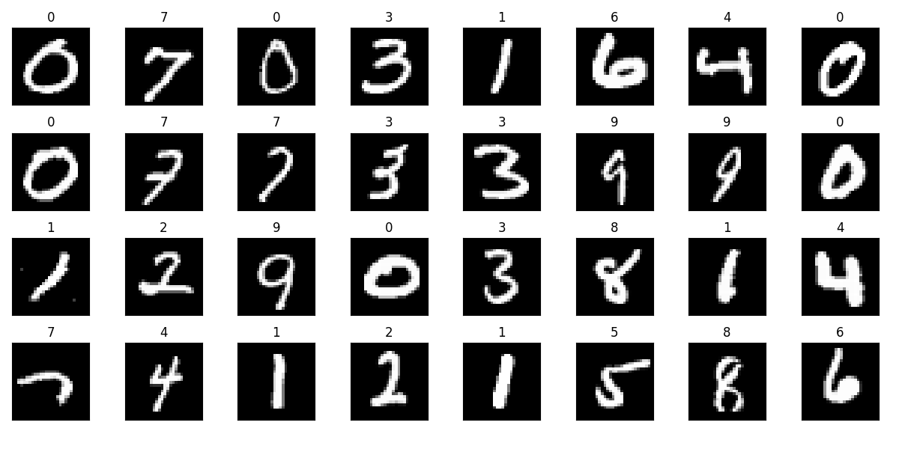

# Final Project of Fundamentals of Intelligent Science

# 《智能科学基础》课程大作业

实验任务：手写数字识别，使用CNN模型，数据集为MNIST。

实验环境：

| 编程语言 | Python 3.8                |
| -------- | ------------------------- |
| 编译器   | Visual Studio Code 1.85.0 |
| 框架     | PyTorch 2.1.1             |
| conda    | Anaconda(conda 23.9.0)    |
| cuda     | 12.0                      |

文件组织架构：


**以下为实验报告：**

## 1.  实验内容

### 1.1 实验任务

使用CNN模型，对MNIST数据集进行手写数字识别。

### 1.2 主要方法

深度学习，CNN模型。

## 2.  实验方案与步骤

### 2.1 方法原理

 

### 2.2 实验方案

 

### 2.3 实现步骤

 

## 3.  实验结果

### 3.1 实验数据详情

- 数据集：MNIST
- 训练集：60000
- 测试集：10000

### 3.2 实验环境设置

- 编程语言：Python
- 模型结构：CNN
- 参数选择：
  ```python
  
  ```


### 3.3 实验结果及分析

（须将自己编写算法执行后的结果截图贴出）



 

## 4.  总结

（实验时遇到的问题和解决方法）